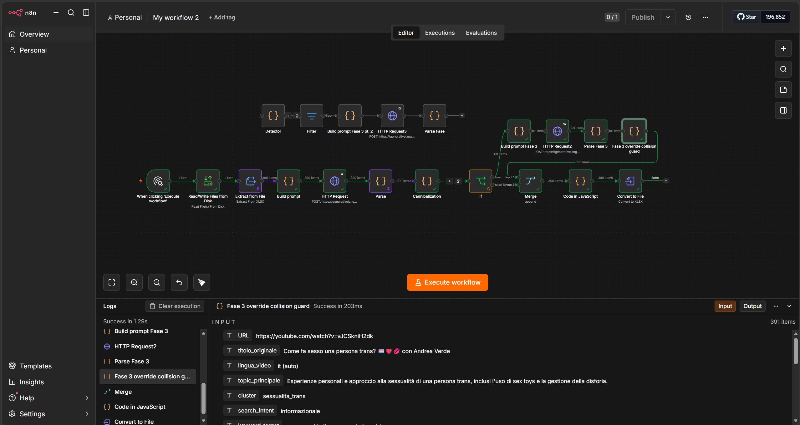
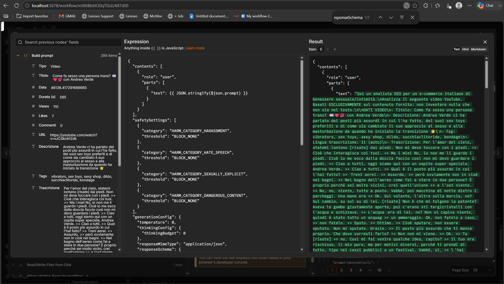
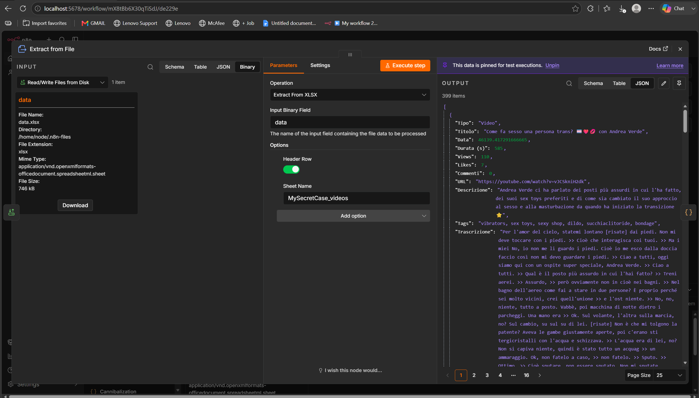
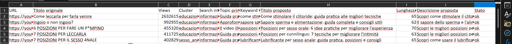
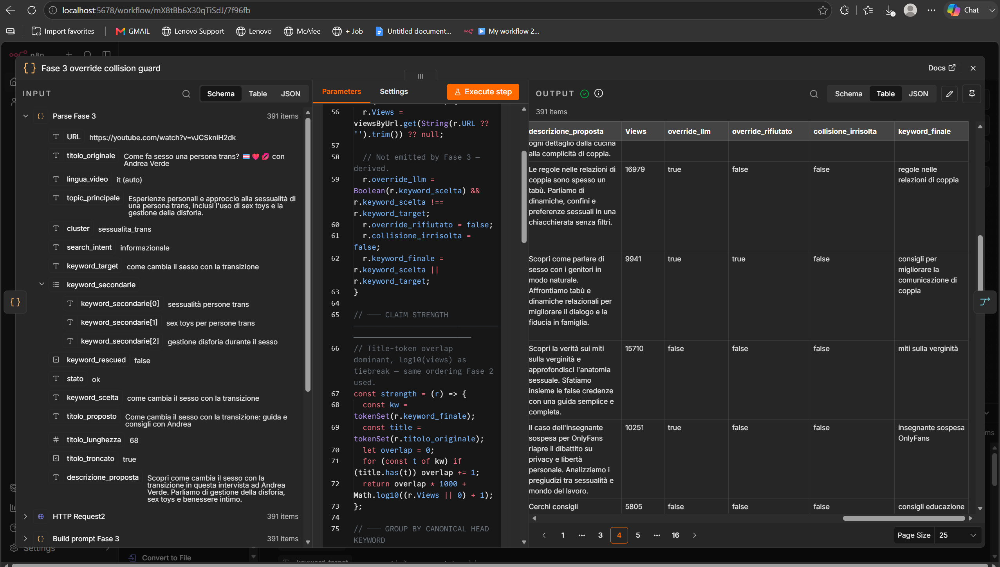
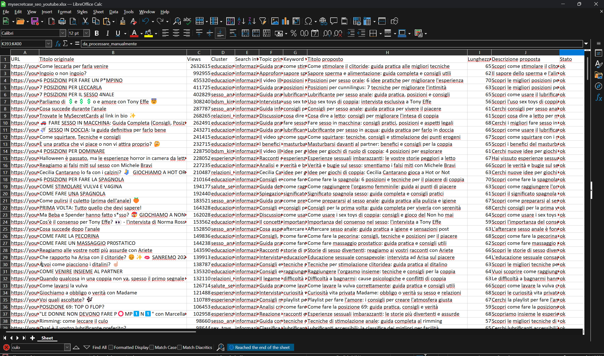

# MySecretCase-Youtube-Seo-Optimization-Pipeline-self-hosted-n8n

YouTube SEO Optimization Pipeline — MySecretCase

THIS IS A DEMO REQUESTED TO ME BY MYSECRETCASE (FAMOUS ITALIAN SEXTOY COMPANY).

An n8n workflow that takes ~400 YouTube videos (title, description, tags, full transcript), works out what each one is actually about, resolves keyword conflicts across the whole catalogue, and generates an optimized title and description for every video.

Built self-hosted on Docker, running entirely on free-tier APIs.



---

## The problem

The obvious way to do this task is to loop over 400 rows, ask an LLM "what keyword should this video target?", and write the answers to a sheet. That produces a clean-looking spreadsheet that is quietly broken, because dozens of videos independently pick the same keyword.

In a real SERP those videos then compete against each other, split their ranking signals, and none of them wins. That's keyword cannibalization, and nothing in that naive output would flag it.

So the pipeline alternates instead: an LLM pass that understands each video individually, then a deterministic pass that looks at all 399 at once and enforces one head keyword = exactly one owner.

Then a second LLM pass for the copy — and a second deterministic pass to catch the collisions that one reintroduces, because the copywriting model is also working one video at a time and will happily grab a keyword someone else owns.

---

## What I built

A multi-stage SEO optimization pipeline, built around the same principle used in production AI systems:

1. **Ingest** — reads the complete YouTube catalogue (titles, descriptions, tags, transcripts, metadata).
2. **Enrich** — uses an LLM to understand what each video is actually about and extract candidate search queries.
3. **Resolve** — applies deterministic global logic to eliminate keyword cannibalization across the entire catalogue.
4. **Generate** — creates optimized titles and descriptions while preserving the global keyword strategy.
5. **Validate** — catches conflicts introduced by the generation step and guarantees final consistency.
6. **Output** — exports the complete optimized catalogue as XLSX.

**Stack:** self-hosted n8n (Docker) · Google Gemini (AI Studio free tier) · JavaScript (n8n Code nodes) · XLSX processing

---

## Architecture

The pipeline deliberately separates what LLMs are good at from what deterministic code is good at.

The LLM handles semantic understanding:

- what each video is actually about;
- what users would search for;
- how to write natural SEO copy.

The deterministic layers handle global constraints:

- keyword ownership;
- collision detection;
- validation;
- title length enforcement;
- output consistency.



---

## The model choice

I used the generic HTTP Request node rather than n8n's built-in Gemini node because I needed direct control over `responseSchema` and `safetySettings`, and the pre-built node abstracts those away.

### Stack

| | |
|-|-|
| Orchestration | n8n, self-hosted via Docker |
| LLM | Gemini (AI Studio free tier), called through the raw HTTP Request node |
| Model string | `gemini-flash-lite-latest` → currently resolves to `gemini-3.1-flash-lite` |
| Predefined Credential type | (PaLM) |
| Rate limits | 15 RPM / 1,000 requests per day |
| Keyword data | LLM-inferred from transcripts (no paid SEO tool — see Limitations) |
| Libraries | None. Everything custom is plain JS inside n8n Code nodes |

This took a few attempts, and the failures are informative:

`gemini-2.5-flash` — hit the 250 requests/day free-tier cap. Also produced a very clean failure signature: exactly the first 10 calls succeeded and everything after failed, which is the 10 RPM limit.

`gemini-2.0-flash` — same story, separate bucket, also exhausted.

`gemini-2.5-flash-lite` — returned a 404: "no longer available to new users." The model was still listed in the models endpoint, but new API keys can't call it.

`gemini-flash-lite-latest` — works. The `-latest` alias always resolves to the current Flash-Lite, so it can't be retired out from under the workflow.

Side effect worth knowing: that alias moved the pipeline onto the Gemini 3 series. The request bodies still carry `temperature` and `thinkingConfig.thinkingBudget`, which are legacy parameters on 3-series models — accepted for backwards compatibility, silently ignored, no errors.

I've left them in deliberately so the workflow stays portable if I point it at a model that does honour them.

Which raises the more important point: `responseSchema` is what actually buys structural determinism here, not temperature.

Forcing a JSON schema means the output is always parseable and always the right shape. Temperature isn't load-bearing for this — I verify stability by re-sampling instead.

---

## How it works

### Fase 0 — Ingest

`Manual Trigger → Read/Write Files from Disk → Extract from File (XLSX)`

Source file goes into the container with `docker cp` to `/tmp/data.xlsx`.

I read XLSX rather than CSV on purpose — the transcripts are full of commas, quotes and line breaks, and XLSX is structured so there's no delimiter or encoding guesswork.

**Output:** 399 items.

**Input columns:** `Tipo, Titolo, Data, Durata (s), Views, Likes, Commenti, URL, Descrizione, Tags, Trascrizione, Lingua trascrizione`



---

### Fase 1 — Per-video enrichment (LLM)

`Build prompt (Code) → HTTP Request → Parse (Code)`

For each video, using only what's actually in the transcript, extract:

- `topic_principale` — what the video is genuinely about
- `cluster` — a normalized theme label
- `search_intent` — informational / commercial / transactional
- `keyword_candidate[]` — 5–8 realistic Italian search queries
- `lingua`

This is the semantic understanding phase. The model is not asked to solve the catalogue-level problem yet — it only understands each individual video.

Implementation details that mattered:

### Prompt injection safety

The prompt is assembled in JS, then injected into the request body via `{{ JSON.stringify($json.prompt) }}`.

Transcripts contain quotes, newlines and emoji — without the stringify they break the JSON body outright.

### Throttling

HTTP Request node → Options → Batching, 1 item / 5000ms.

This is the only mechanism that actually works.

I first tried a Wait node after the HTTP request, which does nothing: n8n executes node-by-node, so all 399 calls complete before a single item reaches the Wait.

Runtime ends up around 30 minutes.

### Resilience

Retry On Fail (5 tries, 5000ms — n8n's ceiling), On Error set to Continue so one bad row doesn't destroy a 30-minute run.

The Parse node uses try/catch and writes `_parse_error` plus the real `finishReason` / `blockReason` rather than a useless null.

Measured cost: ~3,233 input tokens per video, ~1.3M input tokens for the phase.

---

### Fase 2 — Cluster normalization + cannibalization resolution

Single Code node, Run Once for All Items.

No LLM calls, fully deterministic, runs instantly.

This is the core anti-cannibalization layer.

Because Fase 1 classified every video independently, similar videos can naturally converge on the same keywords. The job of this phase is to enforce one head keyword = exactly one owner.

## How keyword ownership works

### Normalize the clusters

Because Fase 1 classified each video in isolation, near-identical videos ended up in different buckets.

A mapping dict merges them:

- `anatomia_sessuale → salute_sessuale`
- `masturbazione → educazione_sessuale`
- `lubrificanti → sex_toys`

### Canonicalize keywords

For collision detection:

- lowercase;
- strip accents (NFD);
- strip punctuation;
- drop Italian stopwords;
- sort the remaining tokens.

This makes:

`come fare la spagnola`

and:

`6 posizioni per fare la spagnola`

collide correctly, which they should — they're the same query.

### Greedy global assignment

Award the most-contested keywords first, to the strongest claimant.

Claim strength is:

- title-token overlap (dominant term);
- plus `log10(views)` as a tiebreak.

So an evergreen how-to beats a reaction video that merely mentions the topic.

Losers get their least-contested unclaimed candidate.

Everything else is preserved as `keyword_secondarie[]`.

### Rescue pass

Strict dedup can strand a specific video on a vague keyword.

A blocklist of ~22 catch-all phrases catches those, and swaps in a specific unclaimed candidate that better matches the title.

Flagged with `keyword_rescued: true` so I can audit it.

Views and Likes are rejoined from the pinned ingest node via `$('Extract from File').all()`.

Each row is emitted with:

- `stato: 'ok'`
- `stato: 'da_processare_manualmente'`

---



---


## Fase 3 — SEO copy generation (LLM)

`IF (stato = ok) → Build prompt → HTTP Request → Parse`

Both branches are used: the true branch carries on through Fase 3, and the false branch — the 8 blocked rows — runs straight to the Fase 4 merge, so nothing is dropped and nothing has to be re-read from a pinned node later.

The model receives the topic, the assigned `keyword_target`, and the secondary candidates.

It may override the deterministic assignment only when an alternative is clearly more specific to the video — otherwise it keeps what Fase 2 gave it.

Returns:

- `keyword_scelta`
- `titolo_proposto`
- `descrizione_proposta`

---

## Deterministic title validation

The ≤70 character title limit is enforced in code, not by the prompt — LLMs can't count characters reliably.

Titles are truncated at a word boundary and flagged with `titolo_troncato` so nothing is silently mangled.

Word-boundary truncation isn't enough on its own, though.

It leaves titles hanging on an article or a preposition:

> "...guida alla comunicazione di"

> "...consenso, anatomia e"

which reads as broken unstead of shortened, and in Italian it's immediately obvious to a native speaker.

So a second deterministic pass strips trailing function words repeatedly until the title ends on a real word, and only accepts the result if it's still over 40 characters.

Pure code, no API calls.

391 calls — one per row that cleared Fase 1 — at roughly 32 minutes on the throttle.

---


---

# Fase 3.5 — Override collision guard

Single Code node, Run Once for All Items.

No LLM calls.

This node exists because of a problem I didn't see until I looked at the Fase 3 output properly, and it's the most interesting bug in the project.

The override can re-create the exact problem the architecture exists to prevent.

Fase 2 guarantees one keyword per video by looking at all 399 at once.

Fase 3 then lets the model swap to a better-fitting alternative — but it picks from `keyword_secondarie`, which by construction is a list of keywords that other videos already won.

And Fase 3 sees one video at a time.

It has no idea anyone else owns them.

It's not a rare edge case either.

The override is aimed at videos stranded on vague keywords, and those are precisely the videos whose secondary candidates are the contested ones.

Collisions cluster exactly where the override fires.

---

## Real examples from the run

The Wax interview tried to take:

`pratiche BDSM per principianti`

already owned by another video.

Both Truth or Drink videos independently tried to take:

`parlare di sesso con i genitori`

from the Chadia Rodriguez one.

Ship that and you've published duplicates while believing you'd deduplicated.

---

## Guard validation

The guard runs after Fase 3 and validates globally:

### Rejoin Views

Fase 3's output drops `Views` and `Likes` — the prompt-building node doesn't carry them forward — so they're re-joined on `URL` from the pinned ingest node.

Needed for the tiebreak, and worth having in the deliverable anyway.

### Group by canonical keyword form

Reusing the same canonicalizer as Fase 2 so collisions are detected the same way they were resolved.

### Override ownership

Whoever overrode, loses.

A video that kept its Fase 2 assignment outranks any overrider by construction, so the overrider reverts to `keyword_target` — globally unique by definition.

Flagged:

`override_rifiutato`

### Resolve upstream collisions

Two non-overriders colliding means Fase 2's uniqueness was already broken upstream, and neither has anything to revert to.

The stronger claimant keeps it; the other takes its best unclaimed secondary.

Flagged:

`riassegnato_da_collisione`

### Verify

A final pass re-counts every keyword and reports residual duplicates, instead of assuming one pass was enough.

One pass is provably enough — a reverted row falls back to a keyword Fase 2 already made unique — but I'd rather assert the invariant than trust it.

---

## Results

12 overrides rejected, every one a genuine collision.

2 upstream collisions resolved.

The tradeoff, stated plainly:

when the guard reverts a video, that video goes back to its vague keyword.

It's stranded again.

That's the right call — one video on a weak keyword ranks poorly by itself, but two videos on the same keyword rank poorly and split each other's signals, and the sheet looks correct while being broken.

The general shape of this:

the LLM proposes without global knowledge, a deterministic pass validates the proposal against global state and rejects what conflicts.

Same pattern as Fase 2, applied to the model's own second-guessing.

---



---

## Fase 4 — Output

`Guard → Merge (input 1)` and `IF false branch → Merge (input 2)`, then `Merge (append) → Normalize (Code) → Convert to File (XLSX)`

The 8 unprocessable rows come back in through the IF node's false branch — a live connection rather than a re-read of pinned output, which is one less thing to go stale.

The normalizer is a Code node instead of a Set node, because the two branches have genuinely different shapes:

- the failed rows never got any Fase 3 fields;
- the processed rows lost `Views` before the guard put them back.

Writing every column explicitly, with empty strings for what's missing, is the only way the XLSX columns don't get ragged exactly where the failures are.

It also flattens `keyword_secondarie` to a pipe-joined string and sorts by status then views descending, so the highest-traffic videos are the first thing anyone sees and the 8 manual rows sit at the bottom.

**Output:** 399 rows — all of them, processed or flagged.



---

# By the numbers

| | |
|-|-|
| Videos ingested | 399 |
| Enriched successfully in Fase 1 | 391 |
| Blocked by `PROHIBITED_CONTENT` | 8 (~2%) |
| Left on a generic keyword after Fase 2 | 8% of processed rows |
| LLM overrides rejected by the guard | 12 |
| Upstream collisions resolved by the guard | 2 |
| Rows in the final sheet | 399 |
| Fase 1 input tokens | ~1.3M (~3,233 per video) |
| Total LLM calls | 790 |


---

# Design decisions

## Clustering strategy

Grouped by theme — not treated individually.

This was the central design decision of the whole task.

It works in two stages.

The LLM assigns a normalized cluster label per video during Fase 1, grounded strictly on the actual transcript rather than on what the model thinks it knows about the topic.

Fase 2 then normalizes those labels and resolves keyword overlap globally, across all 399 videos at once.

The reason is the cannibalization problem described at the top.

Left to itself, the per-video pass had dozens of videos converging on the same handful of head terms:

- come raggiungere l'orgasmo femminile
- differenza tra vulva e vagina
- cos'è il pegging

Publishing that would have MySecretCase's own videos fighting each other for the same position.

So the rule is enforced structurally:

one head keyword, exactly one owner.

Runner-up queries aren't thrown away, they become secondary keywords.

---

The honest cost of this:

strict deduplication can strand a video on a weak, generic keyword when all its specific ones were claimed by stronger videos.

I measured it rather than guessing — 8% of processed videos end up on a generic keyword after Fase 2.

That's the real size of the problem, and it's why the Fase 3 override exists at all.

### Secondary keyword ownership — a V2 improvement

One weakness in the current handoff between Fase 2 and Fase 3 is that the model receives `keyword_secondarie[]` without any information about their global ownership state.

After Fase 2, some of those alternatives may still be unclaimed, while others may already belong to another video. Fase 3 cannot tell the difference: it sees only the current video's `keyword_target` and its alternatives, and evaluates them semantically in isolation.

That means the model can choose a genuinely better-fitting secondary keyword that is already owned elsewhere, forcing the guard to reject the override afterwards.

A stronger version would propagate ownership metadata from the deterministic phase into the generation phase, for example:

```text
keyword_target: X

keyword_secondarie:
- A — occupied
- B — unclaimed
- C — occupied
```

The model could then be instructed to keep the assigned target by default, and only override it with an unclaimed alternative that is clearly more specific.

If every suitable alternative were already occupied, I could also allow the model to propose a new candidate rather than forcing it back onto a weak keyword.

That still would not remove the need for the final guard.

Two videos are processed independently in Fase 3, so they could both select the same currently-unclaimed alternative, or independently generate the same new query. A newly generated phrase could also canonicalize to an existing keyword.

So the stronger architecture would be:

**deterministic ownership metadata → constrained LLM override → deterministic global validation**

The current version validates conflicts after generation. A second iteration would prevent more of those conflicts before generation as well, while still asserting the invariant afterwards.


Three things push back on it:

- the code-based rescue pass in Fase 2;
- the LLM's permitted override in Fase 3;
- the guard that stops the override from causing collisions of its own.

What's left after all three is the documented residual.

With real keyword volume data I'd re-rank assignments by actual search demand instead of leaning on title-overlap heuristics.

---

# Error handling

8 of 399 videos (~2%) failed with `PROHIBITED_CONTENT`.

These are the porn-reaction videos whose transcripts describe explicit scenes in detail.

This is a hard, non-overridable block on Google's side — distinct from the four `SAFETY` categories, which I did disable via `safetySettings: BLOCK_NONE`, since this is a legitimate adult wellness catalogue.

Those rows aren't dropped.

They're flagged `da_processare_manualmente` and carried all the way through to the final sheet, so the deliverable accounts for all 399 videos rather than quietly containing 391.

---

# Limitations & what I'd do with a budget

## No real keyword volume or difficulty data

No budget for Ahrefs / SEMrush / DataForSEO, so keywords are inferred by the LLM from transcript content.

With a paid data source I'd re-rank the assignments by actual search demand rather than title-overlap heuristics.

## No SERP measurement

Verifying that any of this actually moves rankings requires deployment plus weeks of tracking.

## Free-tier quota ceiling

1,000 req/day forced the work across multiple days and ruled out multi-pass refinement.

At scale I'd use Gemini Batch Mode — asynchronous and roughly half the cost.

## Embeddings

Clustering uses LLM labels, not embeddings — and the limit is visible in the output rather than hypothetical.

Roughly a dozen reaction videos target functionally interchangeable queries:

- `confessioni sessuali`
- `confessioni sessuali anonime`
- `confessioni intime anonime`
- `racconti intimi anonimi`
- `racconti erotici reali`

They share no tokens, so no amount of canonicalization collides them.

Same for:

- `come squirtare`
- `come squirtare consigli`

and:

- `come prepararsi al sesso anale`
- `preparazione sesso anale igiene`

there's no stemming.

A stronger version would use Gemini embeddings plus k-means or HDBSCAN for genuinely semantic clusters rather than label matching.

---

## Description generation limitation

Descriptions insert the keyword verbatim.

Where the keyword is a real Italian phrase this is fine, and one prompt line permitting grammatical adaptation fixed most of it.

Where the keyword is a stack of nouns rather than a phrase:

`coaguli mestruali cause`

`orgasmo capezzoli come fare`

the sentence comes out forced, because fixing it would require reordering the keyword's own words.

I built and tested a second pass that permits exactly that reordering, then ran out of free-tier quota before running it.

The detector flags 86 rows and is deliberately loose: regenerating a description that was already fine is cheap, missing a broken one isn't, so the true count is lower.

The node is still in the workflow, disabled.

---

## Google Sheets integration

Fase 4 isn't fully automated.

Google Cloud Console required payment-method verification (2–3 day wait) to set up, so the workflow emits XLSX for a one-click import instead of writing directly into the Sheet.

---

## Data privacy

Free-tier Gemini may use submitted data for product improvement, and these transcripts are MySecretCase business content.

Production should run on the paid tier or Vertex AI, which excludes data from training.

A self-hosted model via Ollama would solve both this and the `PROHIBITED_CONTENT` blocks.

---

## Dataset notes

399 rows, not 400 — most likely a header or an empty trailing row.

Not investigated.

---

# SEO choices

Non-explicit phrasing is preferred wherever it captures the same search intent.

Explicit terms get suppressed by SafeSearch, so wellness and educational framing simply ranks better in this niche.

Titles front-load the keyword, read naturally, and avoid caps, emoji and misleading clickbait.

Descriptions carry the keyword and the hook inside the first 150 characters, which is what's visible before the fold.
